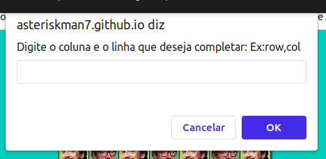
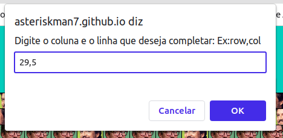

# Complete-PedroPascalsTriangleOfPrestige

## Usando Complete-PedroPascalsTriangleOfPrestige
Para usar o Complete-PedroPascalsTriangleOfPrestige, siga estas etapas: 

### Ative o painel utilizando ```Ctrl+Alt+C```



### Digite a linha e a coluna do Pedro que deseja completar, ex:


